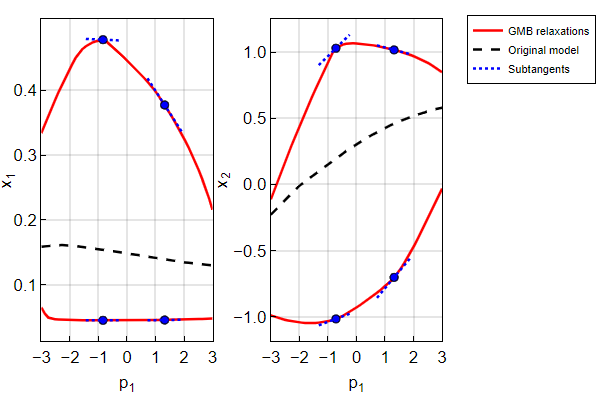
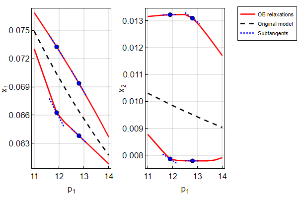

# convex-ode-subgradients

Convex relaxations of nonconvex functions are useful in methods for global optimization, since local minimization of a convex relaxation will provide a lower bound for the overarching global optimization problem. Consider a parametric ordinary differential equation (ODE) system:

$$
\begin{align*}
\dot{\mathbf{x}}(t,\mathbf{p})&=\mathbf{f}(t,\mathbf{p},\mathbf{x}(t,\mathbf{p})),\quad\forall t\in(t_0,t_f],\\
\mathbf{x}(t_0,\mathbf{p})&=\mathbf{x}_0(\mathbf{p}).
\end{align*}
$$

We consider two established methods for computing useful (but perhaps nonsmooth) convex relaxations of solutions of this parametric ODE system, namely,
- the generalized-McCormick-based (GMB) relaxations proposed by [Scott and Barton (2013)](https://link.springer.com/article/10.1007/s10898-012-9909-0), and
- the optimization-based (OB) relaxations proposed by [Song and Khan (2022)](https://link.springer.com/article/10.1007/s10107-021-01654-x).

These methods both describe relaxations of ODE solutions as solutions of auxiliary parametric ODE systems of the following general form: $\forall t\in(t_0,t_f]$,

$$
\begin{align*}
\dot{\mathbf{x}}^\mathrm{cv}(t,\mathbf{p})&=\mathbf{u}(t,\mathbf{p},{\mathbf{x}}^\mathrm{cv}(t,\mathbf{p}),{\mathbf{x}}^\mathrm{cc}(t,\mathbf{p})),&\mathbf{x}^\mathrm{cv}(t_0,\mathbf{p})&=\mathbf{x}_0^\mathrm{cv}(\mathbf{p}),\\
\dot{\mathbf{x}}^\mathrm{cc}(t,\mathbf{p})&=\mathbf{o}(t,\mathbf{p},{\mathbf{x}}^\mathrm{cv}(t,\mathbf{p}),{\mathbf{x}}^\mathrm{cc}(t,\mathbf{p})),&\mathbf{x}^\mathrm{cc}(t_0,\mathbf{p})&=\mathbf{x}_0^\mathrm{cc}(\mathbf{p}).
\end{align*}
$$

(Discontinuous jumps in Scott-Barton's formulation are neglected in this description, though we argue that these cannot occur when the considered subdomain is sufficiently small.)
The GMB and OB relaxation methods construct different right-hand-side (RHS) functions $(\mathbf{u},\mathbf{o})$ for use in the ODEs above.

This repository illustrates our new approaches for computing subgradients for the GMB and OB relaxations. The subgradients are useful for solving the bounding problems constructed from ODE relaxations in a branch-and-bound procedure.  This repository contains Julia code for all numerical examples in our accompanying manuscript:

 > Y. Song and K.A. Khan, Computing subgradients of convex relaxations for solutions of parametric ordinary differential equations, under review.

This implementation was developed by Yingkai Song in Julia. This repository is tied to the accompanying article, and will not be updated except for bug fixes. If you make use of this code, please cite our article as above.

This work was supported by the McMaster Advanced Control Consortium (MACC), and by the Natural Sciences and Engineering Research Council of Canada (NSERC) under Grant RGPIN-2017-05944.

## Dependencies

- [DifferentialEquations.jl](https://github.com/SciML/DifferentialEquations.jl) v7.8.0
- [EAGO.jl](https://github.com/PSORLab/EAGO.jl) v0.8.1
- [IntervalArithmetic.jl](https://github.com/JuliaIntervals/IntervalArithmetic.jl) v0.20.9
- [Ipopt.jl](https://github.com/jump-dev/Ipopt.jl) v1.4.1
- [JuMP.jl](https://github.com/jump-dev/JuMP.jl) v1.13.0
- [Plots.jl](https://github.com/JuliaPlots/Plots.jl) v1.38.17

## Method outline
For each parameter values ${\mathbf{p}}$, we compute subgradients of the GMB or OB relaxations by solving forward parametric affine ODE systems of the form: $\forall t\in[t_0,t_f)$,

$$
\begin{align}
\mathbf{S}^\mathrm{cv}(t,\mathbf{p})&=\mathbf{\Theta}^\mathrm{A}(t,\mathbf{p})\begin{bmatrix}
\mathbf{S}^\mathrm{cv}(t,\mathbf{p})\\
\mathbf{S}^\mathrm{cc}(t,\mathbf{p})
\end{bmatrix}+\mathbf{\Theta}^\mathrm{B}(t,\mathbf{p}),&\mathbf{S}^\mathrm{cv}(t_0,\mathbf{p})&=\mathbf{S}_0^\mathrm{cv}(\mathbf{p}),\\
\mathbf{S}^\mathrm{cc}(t,\mathbf{p})&=\mathbf{\Gamma}^\mathrm{A}(t,\mathbf{p})\begin{bmatrix}
\mathbf{S}^\mathrm{cv}(t,\mathbf{p})\\
\mathbf{S}^\mathrm{cc}(t,\mathbf{p})
\end{bmatrix}+\mathbf{\Gamma}^\mathrm{B}(t,\mathbf{p}),&\mathbf{S}^\mathrm{cc}(t_0,\mathbf{p})&=\mathbf{S}^\mathrm{cc}_0(\mathbf{p}).
\end{align}
$$

The involved functions above are constructed automatically based on sensitivity information concerning the functions $(\mathbf{u},\mathbf{o})$ employed by the GMB or OB relaxations. Then, for each $(t,\mathbf{p})$, the transposed row $\mathbf{s}^\mathrm{cv}_{(i)}(t,\mathbf{p})$ is a valid subgradient of the ODE relaxation $x_i^\mathrm{cv}(t,\cdot)$ at $\mathbf{p}$; similarly for $\mathbf{S}^\mathrm{cc}$ and $\mathbf{x}^\mathrm{cc}$. 

Compared to the only established subgradient evaluation method ([Khan and Barton, 2014](https://dspace.mit.edu/handle/1721.1/103513)) for the GMB relaxations, our new method has the advantage that the resulting subgradient evaluation ODE system is affine, and thus can be easily solved by off-the-shelf ODE solvers. Such affine nature also enables an efficient adjoint subgradient evaluation method whose implementation is proposed by Zhang and Khan (2023). Moreover, this system's RHS functions can be readily constructed from established subgradient library provided by [EAGO.jl](https://github.com/PSORLab/EAGO.jl) or [MC++](https://github.com/coin-or/MCpp) in C++. Prior to our current manuscript, there was no existing subgradient evaluation method for the OB relaxations. For more details, please refer to the accompanying manuscript.

## Implementation contents
The [`/src/`](https://github.com/kamilkhanlab/convex-ode-subgradients/tree/main/src) folder provides our code for two numerical examples in the accompanying manuscript. Note that even though this implementation is illustrated using the two examples, the implementation itself is versatile, and can construct ODE relaxation and subgradient evaluation systems automatically for any original parametric ODE system.

### [Example1.jl](src/Example1.jl)

This is a Julia implementation which computes subgradients of the GMB relaxations of an parametric ODE system adapted from [Example 1, Scott and Barton (2013)], producing the plot:

)

### [Example2.jl](src/Example2.jl)

This is a Julia implementation which computes subgradients of the OB relaxations for an ODE system of catalytic cracking of gas oil from [15.3.5, Floudas et al. (1999)], producing the plot:

)

## References

- C.A. Floudas, P.M. Pardalos, C. Adjiman, W.R. Esposito, Z.H. G&uuml;m&uuml;s, S.T. Harding, J.L. Klepeis, C.A. Meyer, and C.A. Schweiger, *Handbook of Test Problems in Local and Global Optimization*, Springer, Dordrecht (1999)
- K.A. Khan and P.I. Barton, Generalized derivatives for solutions of parametric ordinary differential equations with non-differentiable right-hand sides, *J Optim Theory Appl*, **163**, 355-386 (2014)
- J.K. Scott and P.I. Barton, Improved relaxations for the parametric solutions of ODEs using differential inequalities, *J Glob Optim*, **57**(1), 143-176 (2013)
- Y. Song and K.A. Khan, Optimization-based convex relaxations for nonconvex parametric systems of ordinary differential equations, *Math Program*, **196**, 521-565 (2022)
- Y. Zhang and K.A. Khan, Implementing adjoint subgradient evaluation for use in global dynamic optimization, in *Proceedings of FOCAPO/CPC 2023*, in press (2023)

